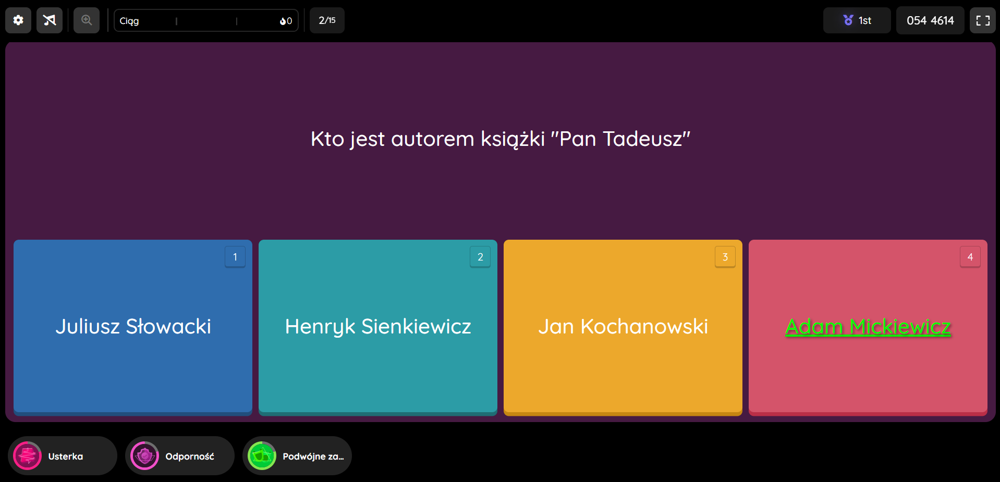
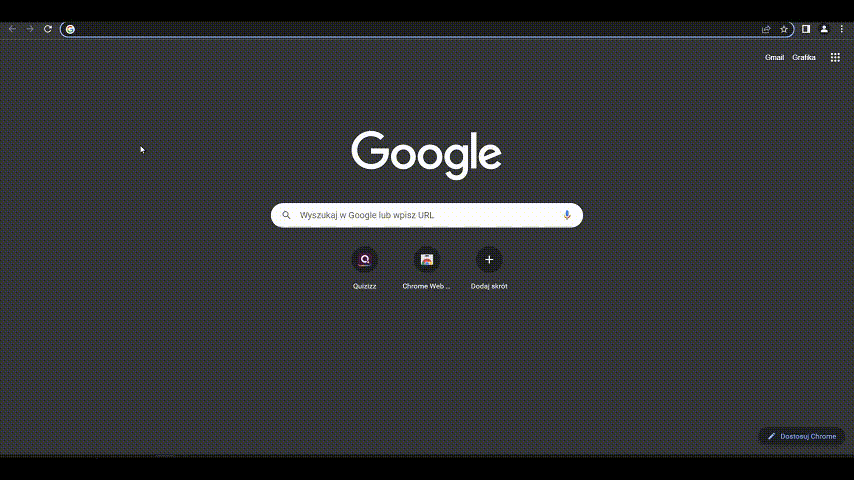

# Quizizz helper
Rozszerzenie do przeglądarki dawające prawidłowe odpowiedzi do pytań na **[quizizz](https://quizizz.com).**

Podświetlona na zielono poprawna odpowiedź na pytanie
# Jak użyć?
## Gif poradnik:

## Tekst poradnik:
1. Wejdź w rozszerzenia.
2. Włącz tryb dewelopera.
3. Załaduj rozpakowany zip z rozszerzeniem.